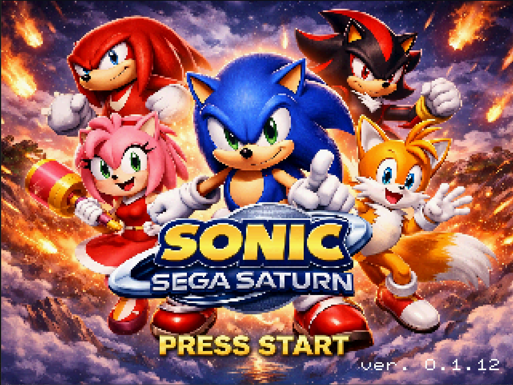
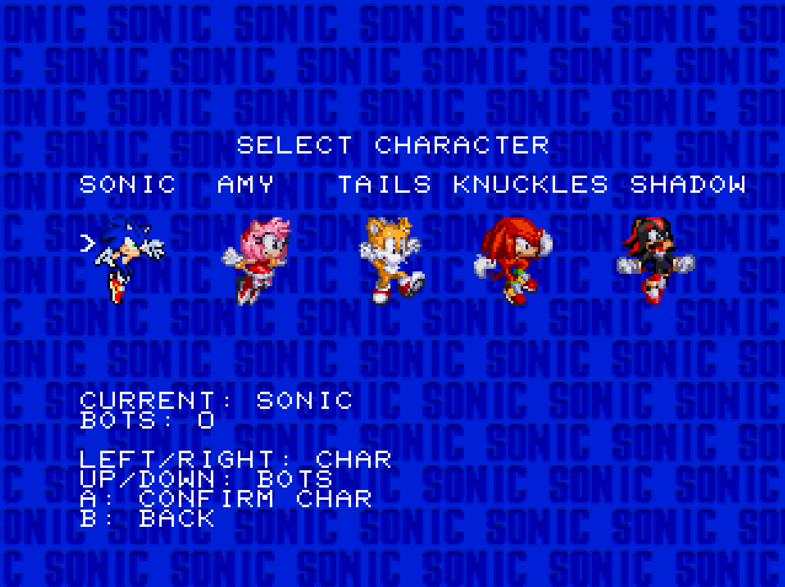
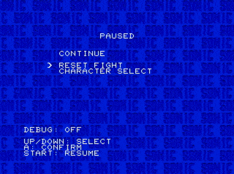

# Sonic SS

Sonic project for the Sega Saturn using Jo Engine.

Compatible with:

- Emulators (tested on Ymir, Yabause and YabaSanshiro).
- CD-R via a disc drive.
- SAROO.

Available features:

- Battles against bots (up to 3 vs 3, characters may be cloned due to sprite limits)
- Player vs Player battles (also up to 3 vs 3 with clones)
- Audio test menu
- Joystick mapping menu

Available characters:

- Sonic — OK
- Amy — OK
- Tails — OK
- Knuckles — OK
- Shadow — Not OK

## Screenshots

### 1. Splash Screen (Press Start)

### 2. Character Select

### 3. Battlefield

To fix:

- Knuckles bot misses the range of the aerial attack and the super punch.
- Knuckles incorrectly allows jumping while holding the super punch.
- Reduce the number of Sonic and Amy sprites.
- Fix Tails's punch combo sequence.
- Fix Amy's kick cooldown timing.
- Create Shadow classes and sprites.