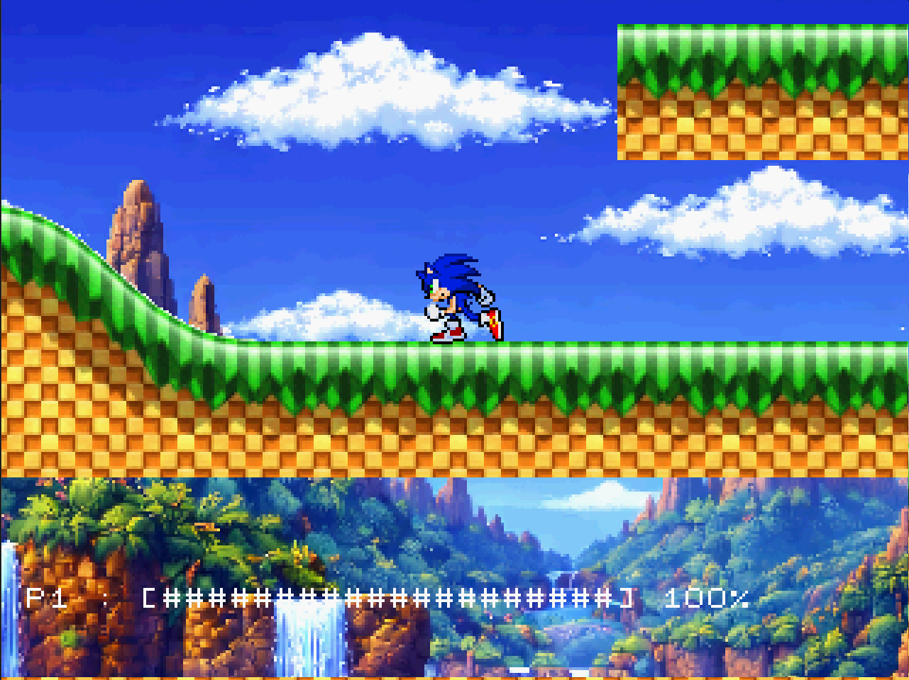
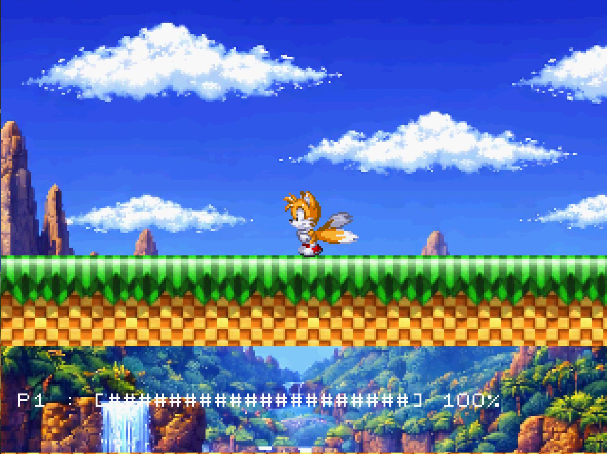
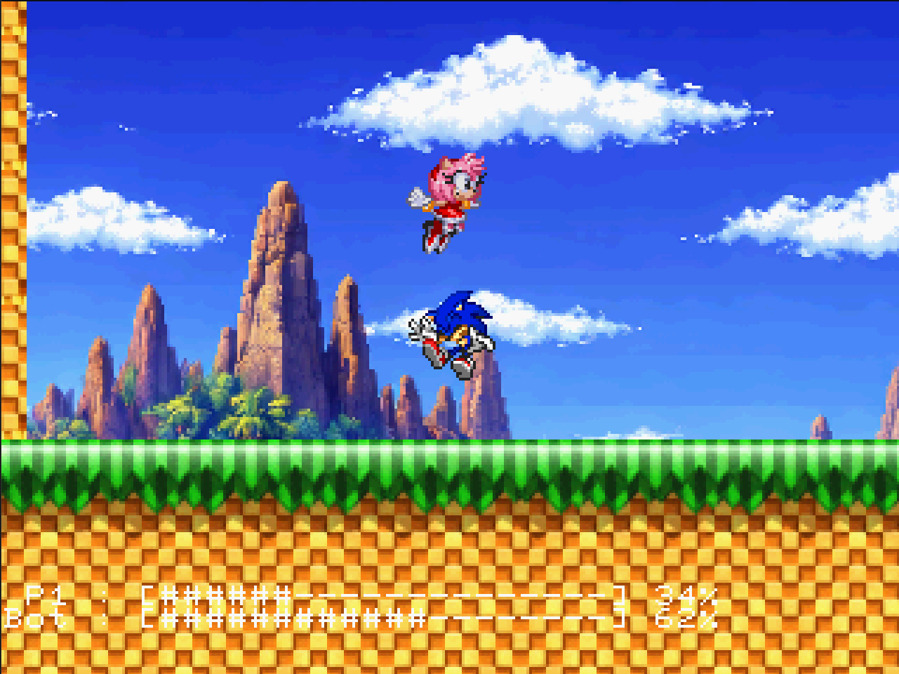

# Sonic SS 

Projeto do Sonic para Sega Saturn usando Jo Engine.
Este jogo é compativel com emuladores, CD físico e também com SAROO.

Recursos disponiveis:

- Batalha contra bots (até 3 vs 3, com personagens clones por causa do limite de sprites)
- Batalha Player vs Player (também até 3 vs 3 com clones)
- Menu de teste de áudio
- Menu de mapeamento de joystick

Personagens disponiveis:

- Sonic — OK
- Amy — OK
- Tails — OK
- Knuckles — Não OK
- Shadows — Não OK

## Screenshots

### 1. Splash Screen (Press Start)

### 2. Character Select

### 3. Sonic Run

### 4. Tails Run

### 5. Battlefield

